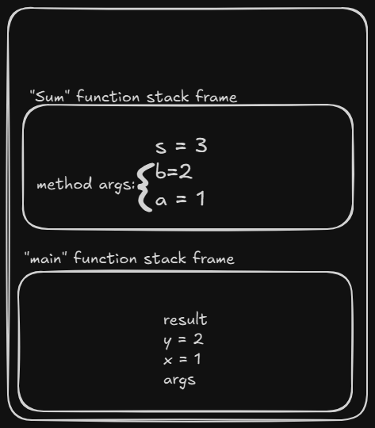

# Stack vs Heap

# Stack:

## Memory region where

- Methods are calling is stacked
- Arguments are passed
- Local Variables are stored
- Stack + instruction pointer = State of each thread's execution.
- Each thread have their own stack memory layout.
- For each method on execution flow, a space from Stack trace is allocated to that method, and is called **Stack frame**.
- Each method have access to Variables, Args of its own stack frame only, no other method can access variable from other Stack frame.

```c
void main(String[] args){
	int x = 1;
	int y = 2;
	int res = sum(x,y);
}

int sum (int a, int b){
	int s= a+b;
	return s;
}
```

Stack works with "FILO" pattern, So `main` function waits for `sum` to finish and return with a value “result".

When method done with its task, its "stack frame" is invalidated and instruction pointer points back previous methos in stack trace via Stack.pop(); method.



# Heap

- Shared between threads process owned memory region.
- All threads share data, what is stored on heap.
- Can Access and allocate data from heap at any moment.

## What is stored on Heap:

- Objects stay in heap as long as there is one reference to them.
- Static Variables stays untouched for life time of process of application/ process.

- Member variables exists. long as their parent object exist.
- Heap is managed by JVM Garbage collector.

How does JVM keep track of number of reference to an object stored in Heap?
What data structure does Heap uses?

## `Refernce ≠ object`

`Object ref1 = new Object();` 
`object ref2 = ref1;`

Here we have 2 reference variables pointing to `object` stored on the stack and 1 object stored on heap.

- if References are declared as local variables inside a method they are stored on a method "Stack frame"
- if References are member of a class then they are allocated on "Heap" together with other members.
- "objects" are always allocated on the heap.

## Why should we share resources across threads?

Consider the case of asynchronous web server (netty), where there are dedicated thread pool for Input request (Work Dispatcher) and another threads poll for worker threads. Now there is clear requirement of a “shared work queue” in between Input request threads and worker threads.